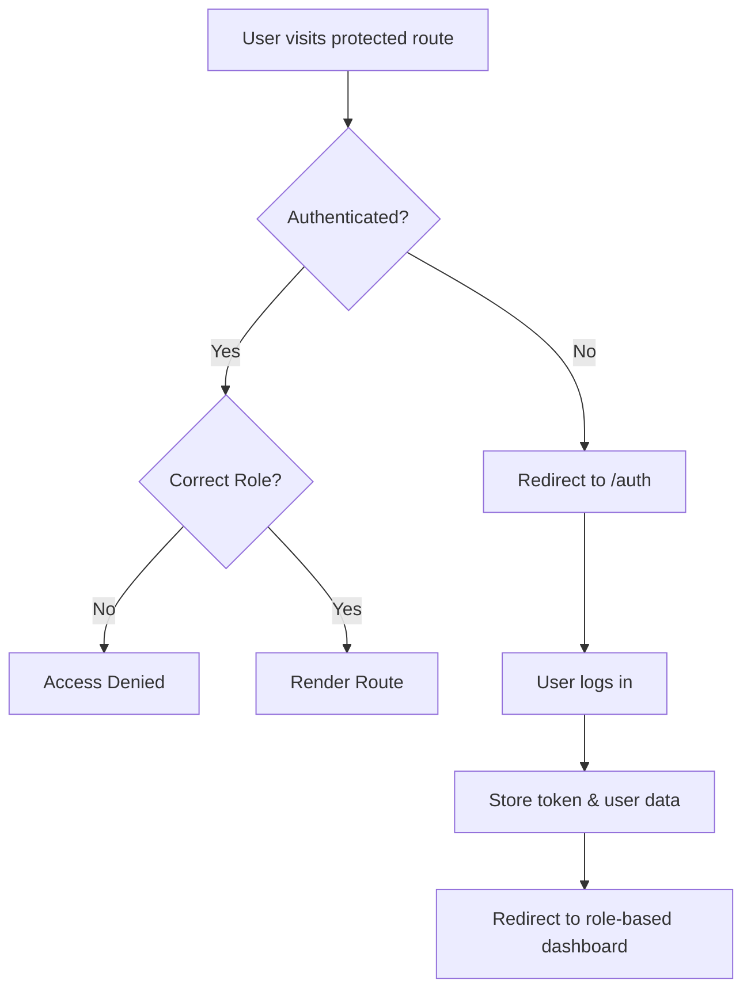

# Routes System Documentation

## Overview

The WanderLanka web application uses a hierarchical routing system built with React Router v6. The system is organized to provide role-based access control and modular route management.

## Architecture

### Route Hierarchy
```
AppRoutes (Main Router)
├── Public Routes
│   ├── / (Landing Page)
│   ├── /home (Home Page)
│   └── /auth (Authentication)
├── Protected Routes (Role-based)
│   ├── /transport/* (Transport Provider Dashboard)
│   ├── /accommodation/* (Accommodation Provider Dashboard)
│   └── /admin/* (System Administrator Dashboard)
└── 404 Route (Not Found)
```

## File Structure

```
src/routes/
├── AppRoutes.jsx          # Main routing component
├── AdminRoutes.jsx        # Admin-specific routes
├── TransportRoutes.jsx    # Transport provider routes
├── AccommodationRoutes.jsx # Accommodation provider routes
├── PublicRoutes.jsx       # Public/unauthenticated routes
└── index.js              # Route exports
```

## Route Components

### 1. AppRoutes.jsx (Main Router)
**Purpose**: Central routing hub that handles all application routes
**Features**:
- Public route management
- Protected route wrapping with role-based access
- 404 error handling
- Layout integration

```jsx
// Example structure
<Routes>
  {/* Public Routes */}
  <Route path="/" element={<LandingPage />} />
  <Route path="/auth" element={<Auth />} />
  
  {/* Protected Routes with Role Guards */}
  <Route element={<ProtectedRoute allowedRoles={["transport"]} />}>
    <Route path="/transport" element={<TransportLayout />}>
      <Route index element={<TransportDashboard />} />
      <Route path="vehicles" element={<VehiclesPage />} />
    </Route>
  </Route>
  
  {/* 404 Handler */}
  <Route path="*" element={<NotFound />} />
</Routes>
```

### 2. Protected Route System

#### ProtectedRoute Component
- **Location**: `src/components/ProtectedRoute.jsx`
- **Purpose**: Role-based access control
- **Features**:
  - Token validation
  - Role verification
  - Automatic redirection to login
  - Layout wrapping

#### Supported Roles
- `tourist` - Regular users/tourists
- `transport` - Transport service providers
- `accommodation` - Accommodation service providers
- `guide` - Tour guides
- `Sysadmin` - System administrators

### 3. Layout Integration

Each protected route section uses its own layout:
- **AdminLayout** - Admin dashboard layout
- **TransportLayout** - Transport provider layout
- **AccommodationLayout** - Accommodation provider layout

## Route Definitions

### Public Routes (No Authentication Required)
| Path | Component | Description |
|------|-----------|-------------|
| `/` | LandingPage | Main landing page |
| `/home` | Home | Home page |
| `/auth` | Auth | Login/Register page |

### Admin Routes (`/admin/*`)
**Required Role**: `Sysadmin`
| Path | Component | Description |
|------|-----------|-------------|
| `/admin` | AdminDashboard | Admin dashboard home |
| `/admin/payment` | AdminPayment | Payment management |
| `/admin/requests` | AdminRequests | User requests management |
| `/admin/complains` | AdminComplains | Complaints management |

### Transport Routes (`/transport/*`)
**Required Role**: `transport`
| Path | Component | Description |
|------|-----------|-------------|
| `/transport` | TransportDashboard | Transport provider dashboard |
| `/transport/vehicles` | VehiclesPage | Vehicle management |

### Accommodation Routes (`/accommodation/*`)
**Required Role**: `accommodation`
| Path | Component | Description |
|------|-----------|-------------|
| `/accommodation` | AccommodationDashboard | Accommodation dashboard |
| `/accommodation/hotels` | HotelsPage | Hotel management |
| `/accommodation/hotels/:hotelid` | Rooms | Hotel room management |
| `/accommodation/bookings` | Bookings | Booking management |
| `/accommodation/payments` | AccommodationPayments | Payment management |

## Authentication Flow

### 1. Login Process


### 2. Role-based Redirects
After successful login, users are redirected based on their role:
- `tourist` → `/tourist` (future implementation)
- `transport` → `/transport`
- `accommodation` → `/accommodation`
- `guide` → `/guide` (future implementation)
- `Sysadmin` → `/admin`

## Navigation

### Programmatic Navigation
```jsx
import { useNavigate } from 'react-router-dom';

const navigate = useNavigate();

// Redirect after action
navigate('/transport/vehicles');

// Redirect with replacement
navigate('/auth', { replace: true });
```

### Link Components
```jsx
import { Link } from 'react-router-dom';

<Link to="/accommodation/hotels">Manage Hotels</Link>
```

## Error Handling

### 404 Not Found
- All unmatched routes render the `NotFound` component
- Users can navigate back to their role-appropriate dashboard

### Unauthorized Access
- Handled by `ProtectedRoute` component
- Automatic redirect to `/auth`
- Token expiration handled by axios interceptors

## Best Practices

### 1. Route Organization
- Keep related routes in their respective files
- Use index routes for default dashboard views
- Maintain consistent naming conventions

### 2. Security
- Always wrap protected routes with `ProtectedRoute`
- Validate user roles on both frontend and backend
- Handle token expiration gracefully

### 3. User Experience
- Provide loading states during authentication checks
- Clear error messages for unauthorized access
- Intuitive navigation between sections

## Adding New Routes

### 1. Public Routes
Add to `PublicRoutes.jsx` or directly in `AppRoutes.jsx`

### 2. Protected Routes
1. Add route to appropriate file (AdminRoutes, TransportRoutes, etc.)
2. Ensure proper role protection in AppRoutes.jsx
3. Create corresponding layout if needed

### 3. New Role-based Section
1. Create new routes file (e.g., `GuideRoutes.jsx`)
2. Create corresponding layout
3. Add protected route section in `AppRoutes.jsx`
4. Update role redirects in authentication logic

## Testing Routes

### Manual Testing
1. Test authentication flow for each role
2. Verify unauthorized access protection
3. Test navigation between routes
4. Verify 404 handling

### Automated Testing
```jsx
// Example route test
import { render, screen } from '@testing-library/react';
import { BrowserRouter } from 'react-router-dom';
import AppRoutes from './AppRoutes';

test('renders landing page on root path', () => {
  render(
    <BrowserRouter>
      <AppRoutes />
    </BrowserRouter>
  );
  // Test assertions
});
```

## Future Enhancements

1. **Lazy Loading**: Implement code splitting for route components
2. **Breadcrumbs**: Add navigation breadcrumbs
3. **Route Guards**: Enhanced permission checking
4. **Analytics**: Route usage tracking
5. **Deep Linking**: Support for complex URL states
